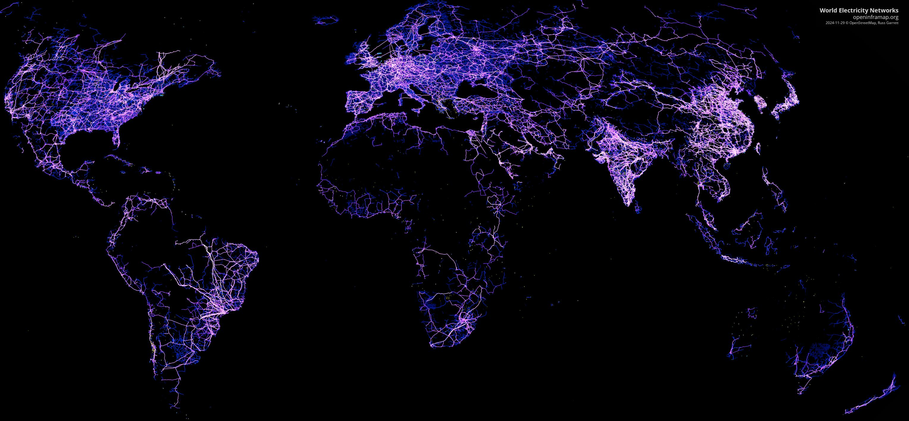
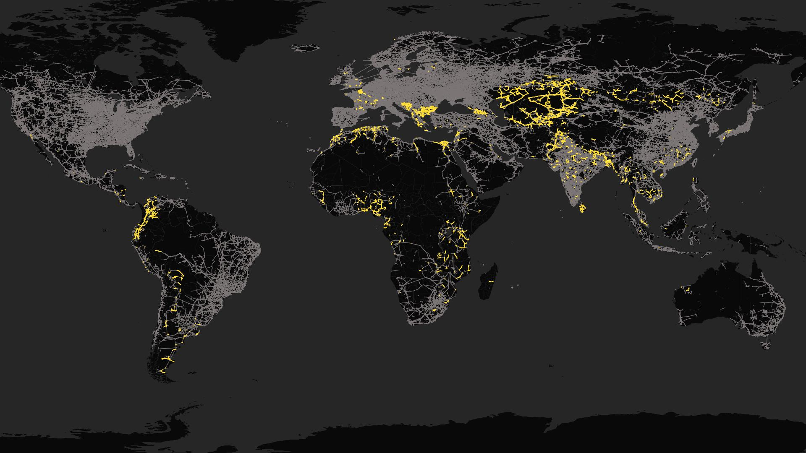
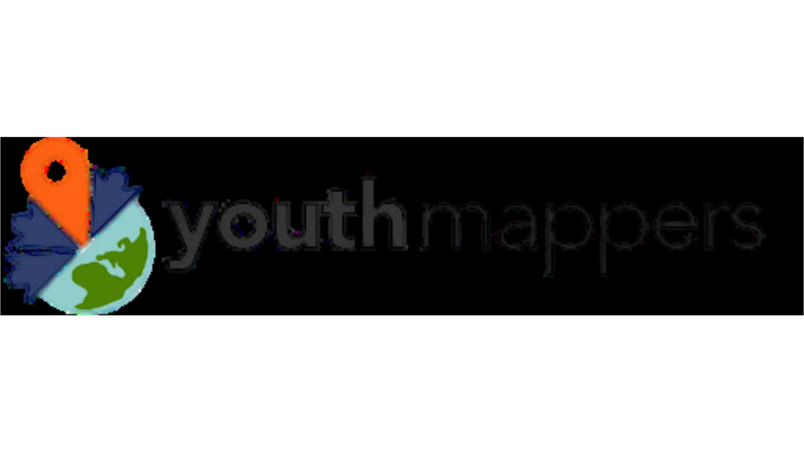

  

    <h1 class="hero-title">MapYourGrid</h1>
    
 Nous donnons aux individus, aux communautés et aux nations du monde entier les moyens de cartographier le réseau électrique.
    

    

     <a href="/starter-kit/" target="_blank" rel="noopener" class="btn btn-primary">
      Apprend à cartographier⚡
     </a>
     <a href="/map-it/" target="_blank" rel="noopener" class="btn btn-secondary">
        Map It📍
     </a>
     <a href="../services/MapYourGrid_Services.pdf" target="_blank" rel="noopener" class="btn btn-secondary">
       Nos Services 💼
     </a>
    

  

  

    
  

 

 <h2>Aidez-nous à cartographier les réseaux électriques mondiaux pour un avenir sans énergie fossile</h2>
 <iframe width="1280" height="720" style="height: auto; aspect-ratio: 16/9;" src="https://www.youtube-nocookie.com/embed/6rcMVXc2lwc?si=tw3xH5gVMvssvz4g" title="YouTube video player" frameborder="0" allow="accelerometer; autoplay; clipboard-write; encrypted-media; gyroscope; picture-in-picture; web-share" referrerpolicy="strict-origin-when-cross-origin" allowfullscreen></iframe>
 
 Les combustibles fossiles sont responsables de plus de <a href="https://www.iea.org/topics/climate-change">75 % des émissions mondiales de gaz à effet de serre</a> Vous pouvez jouer un rôle essentiel dans la transition énergétique en aidant à cartographier les réseaux électriques dans votre région. Ces réseaux ont besoin d'être modernisés et étendus pour répondre aux exigences de l'électrification et de la décarbonisation, mais le manque de données fiables est un obstacle à la transition énergétique. <a href="https://iea.blob.core.windows.net/assets/70f2de45-6d84-4e07-bfd0-93833e205c81/ElectricityGridsandSecureEnergyTransitions.pdf" target="_blank" rel="noopener">obstacle majeur</a> Les données du réseau fournissent aux gouvernements, aux services publics, aux promoteurs et aux chercheurs les informations nécessaires à une planification efficace. C'est là que vous intervenez.

 
Ces dernières années, OpenStreetMap s'est imposé comme la norme de facto pour les données relatives au réseau électrique mondial. Cependant, de nombreux pays en développement sont encore à la traîne. Ce retard limite l'accès à l'énergie dans les zones rurales et ralentit l'action en faveur du climat :

 <blockquote class="blockquote">
 Améliorer la fiabilité et la disponibilité des données afin de mieux évaluer et gérer les risques liés aux projets d'énergie propre dans les marchés émergents et les économies en développement.
 </blockquote>
 

 Recommandation clé - Agence internationale de l'énergie : <a href="https://www.iea.org/events/from-taking-stock-to-taking-action-how-to-implement-the-cop28-energy-goals" target="_blank" rel="noopener">Comment mettre en œuvre les objectifs énergétiques de la COP28</a>
 

 <h2>Vers une grille cartographiée à l'échelle mondiale</h2>
 

 Nous travaillons avec la communauté OpenStreetMap, des organisations et des individus du monde entier pour non seulement créer une base de données sur l'Internet, mais aussi pour améliorer la qualité de l'information. 
 <a href="https://www.nature.com/articles/s41597-025-04550-7" target="_blank" rel="noopener">jumeau numérique ouvert du réseau européen</a>mais aussi d'étendre la couverture globale du réseau de transport dans OSM de 70 % à 98 % d'ici à 2028. <strong>MapYourGrid permet d'atteindre cet objectif grâce à la formation, à de multiples stratégies de validation, à des outils open-source optimisés et à la création d'une communauté.</strong>

 
 
Les données déjà très complètes d'OpenStreetMap sur le réseau électrique peuvent être consultées à l'adresse suivante <a href="https://openinframap.org/#3.34/8.66/41.06/B,E,L,N,P" target="_blank" rel="noopener">Carte des infrastructures ouvertes</a>qui montre l'ampleur mondiale des données collectées depuis 2008, principalement par des bénévoles.
 
 
Une communauté mondiale de contributeurs citoyens crée et maintient des données sur les infrastructures de base de notre société moderne. Donnons le pouvoir aux cartographes !

 
 

 <h2>Notre cartographie</h2>
 

 

 

 🗼
 

 

 ...
 

 
Pylônes depuis mars 2025

 

 

 

 👥
 

 

 ...
 

 
Contributeurs depuis mars 2025

 

 

 

 ⚡️
 

 

 ...
 

 
Lignes électriques en km depuis mars 2025

 

 

 

 
  
  

 Pays où nous avons comblé des lacunes critiques dans le réseau électrique

 

 

 

 

 

 

 

 

 

 

 

 

 

 

 

 

 

 

 

 
<figcaption class="fig-label">
 Toutes les lignes <b>créées et éditées par MapYourGrid</b>. Agrandissez l'image en cliquant dessus.
</figcaption>
 

 

 <h2>S'impliquer</h2>
 

 <a href="https://discord.gg/a5znpdFWfD" class="get-involved-card">
 

 
 

 <h3>Rejoindre notre communauté</h3>
 
Connectez-vous avec d'autres contributeurs sur Discord et participez aux discussions de notre communauté.

 </a>
 <a href="/starter-kit/" class="get-involved-card">
 

 ⚡
 

 <h3>Démarrer la cartographie par quadrillage</h3>
 
Commencez à contribuer à OpenStreetMap et aidez à cartographier le réseau électrique de votre région.

 </a>
 <a href="/map-it/" class="get-involved-card">
 

 📍
 

 <h3>Contribuer à votre pays</h3>
 
Appliquer des stratégies et des outils cartographiques avancés à votre réseau de transmission local.

 </a>

<h2>Qui sommes-nous ?</h2>

 MapYourGrid est une initiative libre et gratuite soutenue par les organisations suivantes. Nous voulons permettre à une communauté mondiale de citoyens et d'organisations de créer et de maintenir des données sur les infrastructures de base de notre société moderne. Vous souhaitez nous rejoindre ou nous soutenir ? Contact <a href="mailto:MapYourGrid@openenergytransition.org" target="_blank" rel="noopener">nous par email</a> 

<h3 class="section-title">Fondée par</h3>

<h3 class="section-title">Partenaires</h3>

  

  
  

  

  
  

 <h3 class="section-title">Sponsorisé par</h3>
 

 
 

<h2>Nos Services</h2>

Nous accompagnons les organisations à chaque étape de la gestion des données d’infrastructures électriques, du développement des compétences internes à la production de données fiables pour la modélisation, jusqu’à l’intégration d’OpenStreetMap dans les workflows SIG. Nos services renforcent la qualité des données, l’autonomie des équipes et la pérennité des données de réseau électrique.

    

      
 🎓 

      <h3>Formation à la cartographie des infrastructures électriques</h3>
      
Nous donnons à vos équipes les moyens de cartographier, valider et maintenir de manière autonome des données d’infrastructures électriques de haute qualité dans OpenStreetMap.

    

   

      
🗺️

      <h3>Services de cartographie des réseaux électriques</h3>
      
Nos cartographes experts renforcent la complétude, la précision et la qualité des données de réseaux électriques dans OpenStreetMap, afin de soutenir une planification énergétique fiable et des travaux de modélisation robustes.

    

  

      
🔗

      <h3>Intégration des données de réseau </h3>
      
Nous vous accompagnons dans l’intégration, la validation et la maintenance de vos données SIG d’infrastructures électriques, en utilisant OpenStreetMap comme une source primaire ou secondaire.

    

  

  

      <a href="/services/MapYourGrid_Services.pdf" target="_blank" rel="noopener" class="btn btn-primary">
       En savoir plus sur nos services 💼
      </a>
      <a href="mailto:MapYourGrid@gmail.com" target="_blank" rel="noopener" class="btn btn-primary">
       Parlez-nous de vos besoins 📧
      </a>
  

  

 <h2>S'abonner à notre bulletin</h2>
 

 
 

<!--Script for the progress numbers, insert stuff above this-->

