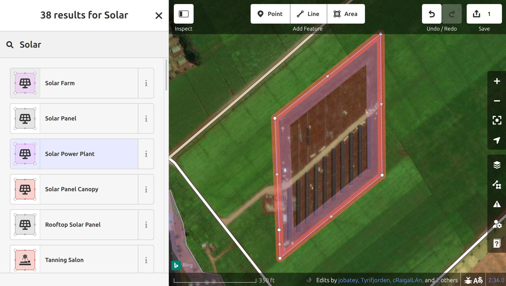
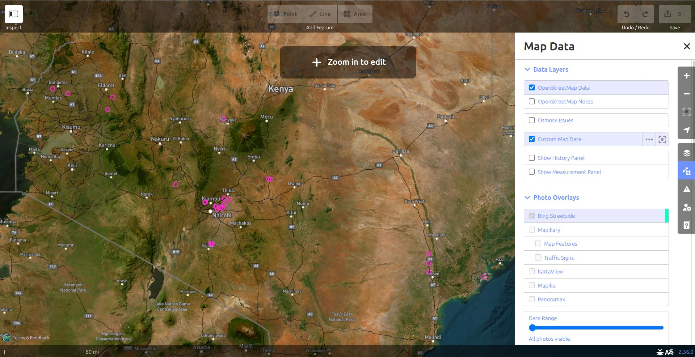

<h1>Starter-Kit </h1>

 
<figcaption class="image-caption">
<a href="https://openinframap.org/#6.54/39.026/-7.548" target="_blank">Open Infrastructure Map</a> showing the detailed transmission and distribution grid in Portugal. Click to enlarge.
</figcaption>

These starter kits empower you to learn how to map your first line of the electrical transmission grid. If you ever get stuck with the Starter-Kit or would like to provide feedback, please contact us via our [community chat](https://discord.gg/fBw7ARTUeR) or [via email](mailto:MapYourGrid@openenergytransition.org). A MapYourGrid community member will help you finish your first line and set up your environment.

We recommend JOSM (Java OpenStreetMap) editor generally, particularly for professional, large-scale grid mapping and to inspect the electrical grid. However, if you only want to make minor edits or leave notes without installing anything, the [iD editor](https://www.openstreetmap.org/edit) provides a user-friendly mapping experience. iD and JOSM can both be combined with [Open Infrastructure Map](https://openinframap.org/). MapComplete provides an optimised workflow for mobile devices for mapping missing tags, such as voltages or capacities. These tools also offer enhanced usability for field mapping tasks and data validation. You can follow our tutorials on this website, or watch our video tutorial for JOSM!

**Get started by clicking on one of the OpenStreetMap editors:**

  <a href="#id-starter-kit" class="btn btn-third">iD Starter‑Kit - Beginner Friendly Small‑Scale Mapping</a>
  <a href="#josm-starter-kit" class="btn btn-primary">JOSM Starter‑Kit - Large‑Scale & Technical Mapping</a> 
  <a href="#id-and-open-infrastructure-map-starter-kit" class="btn btn-third">iD & Open Infrastructure Map Starter-Kit - Advanced iD Mapping & Field Mapping</a> 
  <a href="#mapcomplete-starter-kit" class="btn btn-fourth">MapComplete Starter‑Kit - Missing Tags Field Mapping</a>

## 
iD Starter-Kit
</h3>
Have you spotted some power towers, power plants, issue or substations near your place that are still missing and want to quickly map them yourself? This can be done on your mobile device or PC using the iD editor. In this way, you can also correct voltages, circuits, or other errors you see in Open Infrastructure Map.

The native iD OpenStreetMap editor offers a simple, user-friendly interface that is perfect for beginners or those who want a quick overview of electrical grid mapping. Its simple user interface and web browser integration also make it possible to use this editor on mobile devices, enabling field mapping and validation tasks to be carried out on the ground.

### **
Check out our starter-kit video tutorial for iD
**
<iframe width="720" height="315" style="height: auto; aspect-ratio: 16/9;" src="https://www.youtube-nocookie.com/embed/gAPss8ZeVLs?si=aC-T0GK4Mv3Kcr9e" title="YouTube video player" frameborder="0" allow="accelerometer; autoplay; clipboard-write; encrypted-media; gyroscope; picture-in-picture; web-share" referrerpolicy="strict-origin-when-cross-origin" allowfullscreen></iframe>

****
### 
Map your Good First Line with iD
</h3>

For those who prefer iD to JOSM or are new to OpenStreetMap and electrical grid mapping, the following starter kit provides a quick introduction to mapping your first `Good First Line`. While it is possible to map transmission lines on a mobile device, this is best done on a PC with a mouse. 

  
  <figcaption class="image-caption">Copy the Good First Line coordinates into your editor. Click to enlarge.</figcaption>
   
  <figcaption class="image-caption">Map your first power line, making all nodes power towers and the line itself a power line. Click to enlarge.</figcaption>
  
  <figcaption class="image-caption">Provide a small comment on your mapping success, including a #mapyourgrid hashtag and upload your data. Click to enlarge</figcaption>
  
  <figcaption class="image-caption">Depending on the angle of the sun, power towers casts a distinctive shadow. Take a look at the power towers that have already been mapped and bear in mind that most lines run straight with a similar distance between power towers. Click to enlarge.</figcaption>
  
  <figcaption class="image-caption">Not sure about the exact routing of a transmission line? Simply place the power towers and leave out the transmission lines. </figcaption>

1. [Create an OpenStreetMap account](https://www.openstreetmap.org/user/new?cookie_test=true&referer=%2Fedit%3Feditor%3Did){target="_blank"} and log in.
1. Select a `Good First Line` from the following list, then click on `id Editor`: [Good First Lines :fontawesome-solid-paper-plane:](good-first-lines.md){ .md-button .md-button--primary target="_blank" }
1. This will open a tab within the edit mode of the iD editor, and move you to the location of the `Good First Line` you selected. You should now see a transmission line mapped with the open end at a power tower.  
1. iD will show you all OpenStreetMap data and with `Bing` or `ESRI` satellite imagery underneath. Depending on your region, you might want to switch to different satellite imagery by pressing the `Background Setting` button in the right panel, in case the imagery doesn't show the Power Towers.
1. To extend the power line, you can simply press on the last Power Tower and click `A` on your keyboard to extend the current line. If you don't want to extend the line and instead create a new line, you can also click on the `Line` button in the top panel and afterwards on the last power tower symbol next to the coordinates. 
1. Now, search for the next Power Towers. Looking at how the previous power towers looked will give you an idea of what the next one will look like. Most lines are straight and an equal distance apart. If you cannot see the previous power towers, you may need to switch to satellite view. Don't worry if you miss a power tower. Such issues are automatically detected, so another mapper may spot it.
1. Place a new `node` at the base of all the power towers along the `way`, continuing as far as you can find new towers.
1. Next, you need to tag the line and nodes correctly. To do this, first press `Esc` and then click on the way you have just drawn. In the left panel you can now edit the `Feature`. Press on the `Line` symbol and search for `Power Line`, if the line hasn't already been tagged has `Power Line`.
1. With your new Power Line still selected pressing `CTRL + ↓` will select all the `nodes` along your `Power Line`.
1. Now in the left panel, go back to the search field and search for `Power Tower` or `High-Voltage Tower`. 
1. Press on it, and all you nodes will become `Power Towers`. If you zoom in, you should now see the `Power Tower` now along the line.
1. Once you finished your mapping session, resolve all warnings, issues and errors in your data by clicking on the ⚠️ symbol in the bottom right corner.
1. Now press the `Save` button in the right upper corner. Provide a very short decription what you have done in the Changeset comment, including a `#MapYourGrid` hashtag.
1. Finally press Press `Upload`. Congratulations! You have just mapped your very first transmission line.

Sometimes, there are several possible options for line routing and it is unclear where the transmission lines actually go. In these cases, it is perfectly acceptable to simply place power towers. You can't go wrong by placing power towers. Another more experience mapper will see your towers and finish the line. 

1. Create a `Point` where you can see the power tower with the button in the top middle panel.
1. Make it a `High-Voltage Tower` aka power tower with the feature panel on the left side. 
1. Copy the Power Tower with `CTRL+C` and place it where you see more power towers. 

**Where to go next?** 

* Do you want to find and map further open ending transmission lines in your country using iD? Check out our [find open-ended Transmission Lines with Osmose](#find-open-ended-transmission-lines-with-osmose) in iD workflow.
* Would you like to learn how to map power plants or substations with iD? Or are you interested in finding out how to use iD for in-field mapping? Check out our further [iD and Open Infrastructure Map Starter Kit](#id-and-open-infrastructure-map-starter-kit)

!!! Warning
    **In some countries, mapping power lines is restricted. Always verify local guidelines, connect with the OSM local community first, or check out the [local communities](https://community.osm.be/) and [local projects](https://wiki.openstreetmap.org/wiki/Power_networks#Local_projects). If you can't find a local community, please send us an [email](mailto:MapYourGrid@openenergytransition.org) and we will help you set up a local group.**
    
    **By following our [Mapping good practices](./mapping-good-practices.md), we collectively protect the integrity of the OSM platform, foster trust with communities, and unlock the power of open data for a more resilient and just energy future. Please be aware that the OpenStreetMap community and foundation does not technically limit the mapping in any place on the globe. Therefore, our Mapping good practices cannot be enforced for volunteer community mappers either.** 

## 
JOSM Starter-Kit
</h3>
### **
Check out our starter-kit video tutorial for JOSM
**
<iframe width="720" height="315" style="height: auto; aspect-ratio: 16/9;" src="https://www.youtube-nocookie.com/embed/SCOmFnW7uG8?si=hSxN_3SFm-cFFWuh" title="YouTube video player" frameborder="0" allow="accelerometer; autoplay; clipboard-write; encrypted-media; gyroscope; picture-in-picture; web-share" referrerpolicy="strict-origin-when-cross-origin" allowfullscreen></iframe>

   </a>
  <figcaption class="image-caption">This is what your JOSM should look like after setting up the full Starter-Kit. Click to enlarge.</figcaption>
   </a>
  <figcaption class="image-caption">Different preferences that need to be configured, including the Power Presets. Click to enlarge.</figcaption>
   </a>
  <figcaption class="image-caption">For countries such as Japan, high-resolution imagery is available across the whole country in JOSM. Click to enlarge.</figcaption>

    
### **
1. Install and Configure JOSM  
** 

1. Install JOSM using the [**recommended instructions**](installation-instructions.md){target="_blank"} for your machine.
1. Link your OSM account to JOSM. To do this, go to `Edit → Preferences → OSM Server` and select "Authorise". Login (or sign-up) with your OSM account. Your OSM account should now be linked. On macOS `Preferences` can be found under `JOSM → Settings`
1. Enable `Remote control` in `Edit → Preferences → Remote Control`. This allows for grid data to be loaded automatically from the browser into JOSM. Please note that Safari does not support remote control. You will need to use a different browser to make this work. 
1. Enable `Expert Mode` `View → Expert Mode` to enable search function that you will need. 
1. Understanding JOSM layers. JOSM works with stacked layers, similar to Photoshop or GIS tools:
    * You’ll typically have an OSM data layer, imagery layers, and optionally GeoJSON or task layers.
    * You can switch between multiple satellite imagery sources (for instance, Esri, Mapbox) to use the clearest one for your area.
1. Load your Satellite Imagery via `Imagery` and select `Bing aerial imagery` and `Esri World Imagery`. In the `Layers` window on the right hand side you can now `Show/hide` the different imagery by clicking on the eye. This is also where you will load additional data layers. Changing the order of the data and imagery allows you to combine and overlap the different data sources. Some countries, such as Japan, South Africa and Germany, have their own high-resolution imagery in JOSM. If you are mapping local imagery will automatically be visible under `Imagery`.

!!! Warning
    **In some countries, mapping power lines is restricted. Always verify local guidelines, connect with the OSM local community first, or check out the [local projects](https://wiki.openstreetmap.org/wiki/Power_networks#Local_projects). If you can't find a local community, please send us an [email](mailto:MapYourGrid@openenergytransition.org) and we will help you set up a local group.**
    
    **By following our [Mapping good practices](./mapping-good-practices.md), we collectively protect the integrity of the OSM platform, foster trust with communities, and unlock the power of open data for a more resilient and just energy future. Please be aware that the OpenStreetMap community and foundation does not technically limit the mapping in any place on the globe. Therefore, our Mapping good practices cannot be enforced for volunteer community mappers either.** 

### **
2. Setup your Presets and Quality Assurance Rules 
**

   
  <figcaption class="image-caption">Default MapYourGrid Presets in JOSM toolbar. Click to enlarge.</figcaption>
   </a>
  <figcaption class="image-caption">The existing presets help you to map infrastructure fast and in a standardized way.</figcaption>

1. For ease of mapping, customise your top toolbar with presets if you have not used the default preferences. Right click the toolbar and choose `Configure toolbar` (or also `Preferences → Toolbar`). Then on the right, select `Presets → Man Made → Man Made/Power` and add `Power Towers`, `Power Portal`, `Power Substation`, `Power Plants`, `Power Line` and `Power Generators`, by pressing the button in the middle to add these to your toolbar. These are the main objects you will need for transmission grid mapping. You can also remove the presets you won't use.
2. Another important Preset your will need is `Add Node`. You will find it under `Tools` → `Add Node`. 
3. When you open a new layer later in the tutorial, the toolbar will stop being grey.
4. **Optional** - for more experienced mappers we recommend integrating our validation rules. Add MapYourGrid additional quality assurance rules: `Preferences → Data validator`, on the `Tag checker rules` tab, search for `Power QA`, click on the item in the list, and then on the arrow in the middle of the window to add it to your active rules. These validation rules will help you identify and correct any errors that may have been made. JOSM will run these checks before publishing your data and will display any points requiring verification. Please review them and try to fix them to ensure that the data we produce is usable. You can find [more information and explanations about these rules on the wiki](https://wiki.openstreetmap.org/wiki/Power_networks/Quality_Assurance).

  
  <figcaption class="image-caption">OhmyGrid legend for transmission grid mapping. Click to enlarge.</figcaption>

### **
3. Add Visual Clarity with Custom Map Styles :art:
**

1. In JOSM, go to `Edit → Preferences → Map Paint Styles` and press the "+" in the top right.
2. Paste this [URL](https://raw.githubusercontent.com/open-energy-transition/color-my-grid/refs/heads/main/ohmygrid-default.mapcss){target="_blank"}, or download the raw [file](https://github.com/open-energy-transition/color-my-grid/blob/main/ohmygrid-default.mapcss){target="_blank"} on your device, and add it.
3. Make sure the style is active in the Map Paint Styles menu. You can check this with `Windows → Map Paint styles`.

**Optional steps for an even better visual experience :**

* Not all grids are made the same. Use this MapCSS file for [low-density grids](https://raw.githubusercontent.com/open-energy-transition/color-my-grid/refs/heads/main/ohmygrid-default.mapcss), or this one for [high-density grids](https://raw.githubusercontent.com/open-energy-transition/color-my-grid/refs/heads/main/ohmygrid-default-high-density.mapcss){target="_blank"}. 
* You can check [ColorMyGrid](https://github.com/open-energy-transition/color-my-grid){target="_blank"}, our MapCSS Generator tool, to easily adapt the MapCSS file to your needs. The raw data to edit the [map legend](https://raw.githubusercontent.com/open-energy-transition/color-my-grid/refs/heads/main/legend/power-grid-legend.svg){target="_blank"} is in the ColorMyGrid repo. 

### **
4. Let's map! Choose a Good First Line 
**

   </a>
  <figcaption class="image-caption">A substation of a hydroelectric power plant in Nigeria and the connection to the transmission grid.</figcaption>
  
  <figcaption class="image-caption">The transmission lines do not end abruptly at the pink administrative borders. Therefore, the substation at the end of the interconnector may appear unmapped. The map in the download window displays all OpenStreetMap data, enabling you to swiftly verify whether substations or lines have been mapped. To map across borders, it is always recommended that you load both areas into your editor! Click to enlarge.</figcaption>

Our community is constantly investigating transmission lines that are suitable for beginner friendly mapping experiences. Simply select a 'Good First Lines' from the following page, and tick it if you have started/attemped mapping it. For now, just keep in mind in which country (or region) your picked 'Good first line' is in, as the next step is to load that countries' grid! Select a `Good First Line` from the following page: 

[Good First Lines :fontawesome-solid-paper-plane:](good-first-lines.md){ .md-button .md-button--primary target="_blank" }

### **
5. Load Power Infrastructure into JOSM :inbox_tray:
**

1. Make sure remote control is enabled and ad-blocker disabled, and then go to the start mapping [page](https://MapYourGrid.org/map-it/){target="_blank"}, but come back to this page to read the instructions below! 
1. Here you can click on the country you want to map, and it will directly open JOSM and load the data of that country. The "Default Transmission (50 kV+)" data should already be selected when you open the page. Now press the country, region/state/province of the `Good First Line` you would like to map. To load data for regions/states/provinces, simply zoom in further until the border becomes visible (only works for certain countries for now!). 
1. The data should now automatically appear in JOSM. In the `Layer` window on the right handside you should see the `Data Layer`, which is automatically named with the country/region you pressed on. The ✅ on the left of the Data Layer should be visible, indicating that this is the active layer. All your edits in the main windows will now be part of this `Data Layer`. 
1. Familiarize yourself with the grid data, click on the lines and substation to inspect the tags and memberships in the window in the right side. 
1. **Bonus:** By right clicking on the `Data Layer` of the region you have just downloaded, you can export the grid data in various formats like geoJSON to further process it onn your machine.    

!!! Warning "Risk of Double Mapping and Conflicts"
     Please bear in mind that you have only downloaded transmission grid data for the country, state or province that you selected. This includes power plants, generators, substations, power towers and transmission lines. Other OpenStreetMap objects, such as streets, will not be visible. **Therefore, never use our tools to map objects other than those loaded via Overpass, as otherwise other mappers will have to clean up the duplicate data.**

    Some cross-border transmission lines will still be visible beyond the pink administrative boundaries. However, to edit these, you will need to load both countries. Never map beyond the pink administrative boundaries, as this will most likely result in infrastructure being mapped twice.

    Also keep in mind that some visible objects may be connected to other hidden features even not related to power domain. Deletion is a sensitive operation and JOSM will kindly warn you about risks, particularly about deleting some feature referenced by hidden objects. The safest way to prevent those risks is to select and download OpenStreetMap data, with the help of download button ⬇️ on top left corner, surrounding the feature to be deleted. You will then see the whole picture and won't break anything hidden.

### **
6. Map your First Line
**

  
  <figcaption class="image-caption">Key JOSM elements for continuing a transmission line. Click to enlarge.</figcaption>
   
  <figcaption class="image-caption">Selecting all the finished notes in a line enables you to quickly turn them into Power Towers.</figcaption>
  
  <figcaption class="image-caption">Before uploading, JOSM will test your edits for known issues and various rule sets. Try to resolve as many validation results as possible. Click to enlarge.</figcaption>

 Mapping is an iterative process, so you will make mistakes and that is completely normal. Don't let it stop you; simply map what you can see in the imagery. If you are new to OSM mapping, avoid editing or deleting existing data at all costs. But don't worry, you cannot break anything by adding new data. Everything is constantly validated by our quality assurance tools. 
 
 Now let's Start Mapping:

1. Zoom in on the satellite imagery of the country you will map until you can see the houses and roads.
1. Go to the [**Good First Lines**](good-first-lines.md){target="_blank"} page again, and press on your chosen line. Then, press on JOSM which should open a white page with `OK` on it. Then go to JOSM, and you will see that you have been teleported to the location of that `Good First Line`. If you have the coordinates of a line and want to manually teleport to the location instead, press the `Add Node`  presets button. Paste the coordinates here and press Ok. You should now see power towers that are not mapped at the end of a unfinished transmission line. 
1. ⚠️ Important : If you used the `add node` technique, delete the node you added right away using `Undo Sequence`, to not upload a random node used to move around quickly. , Control+Z, or by selecting it and pressing Delete.
1. To extend or create a line, press `Draw Line`  (left toolbar) or `A` on your keyboard, and click on the last tower symbol at the end of the unfinished power line. You should now be able to extend the line. 
1. Look for the next power tower you can find and click on its footprint. 
1. If you ever feel unsure about how the line runs, just place towers without the lines. By adding power towers you can do nothing wrong. Adding power towers is the easiest way to get started. To do this you can click on an existing tower and `CTRL+C` and then press on where an unmapped power tower is and `CTRL+V`. 
1. Continue the power line to the best of your ability. 
1. Once finished, select your line and press CTRL+Shift+N. This will select all of the nodes on the line. 
1. Then press CTRL+F to open the Search bar. 
1. In the Search string bar above, type`child selected type:node AND untagged`. 
1. ⚠️ In the Results tab on the left, check `Find in selection`. ⚠️
1. Press `Search`. All untagged nodes in your line will now be selected.
1. Apply the `Power Tower`  preset from the toolbar, followed by `Apply Preset`. Now all the nodes you have placed are correctly tagged as `Power Tower`.
1. **Bonus**. Are you mapping with someone else, and/or does the data frequently change? Do you want to update your data in the Editor with the latest tags and extended lines added to OSM since you loaded your data, without loading everything again? By pressing `CTRL+U`, you can update existing geometries and update all the tags, but be aware that completely new geometries and objects that are not connected to existing geometries will not be updated.

!!! note "Pay attention to what you select and upload"
    **⚠️ When applying presets, make sure you only select the untagged nodes of your line. If you accidentally select all untagged nodes in the country and tag them with `Power Tower`, you will upload incorrect data to OSM and will need to revert your changeset.**

### **
7. Upload your Edits to OpenStreetMap :outbox_tray: 
**

1. Whilst having the `Data Layer` activated, press the green arrow pointing upwards , which should open a new window. 
1. Another new window `Validation Results` will appear in the right panel showing all the issues identified. Right-clicking on an issue will allow you to zoom in on it. Avoid ignoring this validation results. The only acceptable warning when uploading data is `Possible missing line support node within power line`. 
1. In the upload window, please tick the `I would like someone to review my edits` tick box if your mapping has been strongly affected by uncertainties like low-quality satellite data, or if you are a beginner. Provide a brief comment such as `#mapyourgrid Unfinished transmission line`. Provide the imagery source layer you used by typing `Esri` or `Bing` for example. Once done and sure about your edits, `Upload Changes`.
1. You just mapped your First Good Line. Feel free to close more First Good Lines, but make sure you leave some for the others. You can use the [Strategies](strategies.md) we have provided to find your own unmapped line. To support our initiative, please use the #MapYourGrid hashtag in the comments when you upload a changeset.

### **
 8. Mapping Guidelines
**

OpenStreetMap provides detailed guidelines on mapping various types of power infrastructure, as well as on how to handle different edge cases. While you don't need to read all of these guidelines before you start mapping, you should be aware of their existence, as they will help you with complex mapping tasks involving power infrastructure and provide lots of examples.

   </a>
  <figcaption class="image-caption">The OpenStreetMap guidelines on hydropower provide detailed examples of how to map different types of installation.</figcaption>

* [Power networks](https://wiki.openstreetmap.org/wiki/Power_networks)
* [Power networks/Guidelines](https://wiki.openstreetmap.org/wiki/Power_networks/Guidelines)
* [Power networks/Guidelines/Power lines](https://wiki.openstreetmap.org/wiki/Power_networks/Guidelines/Power_lines)
* [Power networks/Guidelines/Substations](https://wiki.openstreetmap.org/wiki/Power_networks/Guidelines/Substations)
* [Power generation/Guidelines](https://wiki.openstreetmap.org/wiki/Power_generation/Guidelines)
* [Power generation/Guidelines/Hydropower](https://wiki.openstreetmap.org/wiki/Power_generation/Guidelines/Hydropower)
* [Power generation/Guidelines/Solar plants](https://wiki.openstreetmap.org/wiki/Power_generation/Guidelines/Solar_plants)
* [Power generation/Guidelines/Geothermal plants](https://wiki.openstreetmap.org/wiki/Power_generation/Guidelines/Geothermal_plants)
* [Power generation/Guidelines/Wind farms](https://wiki.openstreetmap.org/wiki/Power_generation/Guidelines/Wind_farms)
* [Power generation/Guidelines/Thermal plants](https://wiki.openstreetmap.org/wiki/Power_generation/Guidelines/Thermal_plants)
* [Power networks/Guidelines/Interconnector](https://wiki.openstreetmap.org/wiki/Power_networks/Guidelines/Interconnector)

### **
 9. Avoid these Common Mistakes :name_badge:
**

   </a>
  <figcaption class="image-caption">In particular, in the dense urban areas that are widespread in Nigeria, it can be very difficult to determine the route of the lines in satellite images. Therefore, mappers simply place unconnected power towers that appear as blue squares at higher zoom levels.</figcaption>

Mapping is an iterative process and mistakes happen. This should not stop you from mapping; simply map what you can verify based on your skillset. If a tower, lines or attributes are missing, our quality assurance tool Osmose will automatically detect this. [Read more about our Quality Assurance and Validation](strategies.md/#quality-assurance-and-validation) layers in OpenStreetMap, and how we build on top of them.

1. Our tools focus on transmission grids, that’s why you might not see lines below 50 kV. To see already mapped lines below 50 kV or lines tagged with `power=minor_line`, download the whole area you’re working on with the green arrow pointing down ⬇️. Even better, you can download a country on Map It 📍 with the `Transmission+Distribution` layer activated.
2. When mapping, make sure to not go across the border of the country you’re working on (visible dashed neon pink lines). Otherwise, you may find yourself mapping something that already exists, but hasn’t been downloaded in JOSM. One of the strategies we have can help with this.
3. Don’t map beyond your expertise. If unsure, leave it for experienced mappers or locals, make a fixme tag, or ask the community! If you ever feel unsure about where to place the lines, just focus on adding power towers. You can't go wrong this way. Adding power towers is the easiest way to get started.
4. Double-check your selection before applying presets, particularly when selecting a great amount of opbjects. This avoids uploading wrong data to OSM and saves you the trouble of going back to clean-up later.
5. As you are contributing on a thematic selection of OpenStreetMap data, visible features may be connected to hidden ones. When deleting some features, always check it isn't connected to anything by downloading OpenStreetMap data surrouding the area, with the help of the download button ⬇️ on top left corner.

For a safe mapping, we recommend you reading about [good practices](https://wiki.openstreetmap.org/wiki/Good_practice){target="_blank"}.

!!! note
    **⚠️ In some countries, mapping power lines is restricted. Always verify local guidelines, connect with the OSM local community first, or check out the [local projects](https://wiki.openstreetmap.org/wiki/Power_networks#Local_projects). If you can't find a local community, please send us an [email](mailto:MapYourGrid@openenergytransition.org) and we will help you set up a local group.**
    
    **⚠️ By following our [Mapping good practices](./mapping-good-practices.md), we collectively protect the integrity of the OSM platform, foster trust with communities, and unlock the power of open data for a more resilient and just energy future.** 

## 
iD and Open Infrastructure Map Starter-Kit
</h3>

On the road and spotted some some power towers, power plants, or substations near your place that are still missing and want to quickly map them yourself? This can be done on your mobile device or PC using the iD editor and Open Infrastructure Map. In this way, you can also correct voltages, circuits, or other errors you see in Open Infrastructure Map.

  
  <figcaption class="image-caption">To place a power tower, you first have to set a node and then add a tag (left). To save your edits on a mobile device using the iD Editor (right), you’ll need to close the inspector panel to reveal the `Save` button. Click to enlarge.</figcaption>

#### 
Power Towers In-Field Mapping
</h3>

1. Go to the [Open Infrastructure Map](https://openinframap.org/#2/26/12){target="_blank"}.
1. Click **Find my location** in the top-right corner or search for your city.
1. Zoom in until you see the small `Edit` button in the lower right corner and press it.
1. [Create an OpenStreetMap account](https://www.openstreetmap.org/user/new?cookie_test=true&referer=%2Fedit%3Feditor%3Did){target="_blank"}. Switch to the `Edit` mode by pressing the button on the top panel.
1. You will now see all OpenStreetMap data with `Bing` or `ESRI` satellite imagery underneath. Depending on your region, you might want to switch to different satellite imagery by pressing the `Background Setting` button in the right panel.
1. By pressing the `Point` symbol in the upper panel, you can now place a node. Now tag this node as a Power Tower using the `Edit Feature` that will appear on the left side. Although filling out the other fields is optional, you are welcome to provide additional information if you know more about the type of power tower.
1. Use the shortcut `CTRL+C` to copy the tower, then place more power towers where you can see them.
1. Upload your data by pressing `Save`. On mobile devices, you first have to hide the left window by toggling the `Inspect` button at the top.
1. Add a `Changeset Comment` with a brief description of your mapping activity. If you find our efforts, documentation and tools helpful, please include the hashtag `#mapyourgrid` in the changeset comment to let us know.

#### 
Substations and Power Plants
</h3>

  
  <figcaption class="image-caption">We recommend using a mouse for mapping multiple substations in iD. If you are on the road, you can also use a touch screen for this. Click to enlarge.</figcaption>
    
  <figcaption class="image-caption">Power plants like solar park can be mapped similar to substations. Click to enlarge.</figcaption>

Once you have finished your transmission line, you will most likely find a substation at the end, and sometimes a power plant will even be located next to it. Therefore, mapping the transmission grid is an effective way of identifying new power plants. Photovoltaic power plants, in particular, are increasing significantly around the world and can be easily identified in satellite imagery.

1. Go to the [Open Infrastructure Map](https://openinframap.org/#2/26/12){target="_blank"}.
1. Click **Find my location** in the top-right corner or search for your city.
1. Zoom in until you see the small `Edit` button in the lower right corner and press it.
1. [Create an OpenStreetMap account](https://www.openstreetmap.org/user/new?cookie_test=true&referer=%2Fedit%3Feditor%3Did){target="_blank"} and log in.
1. By pressing the `Area` symbol in the upper panel, you can now mark the substation. Tag this area as a `Substation` using the `Edit Feature` that will appear on the left side. Add voltages, operators, or other fields if you have this information.
1. Now upload this information by pressing `Save`.
1. Add a `Changeset Comment` with a brief description of your mapping activity. If you find our efforts, documentation and tools helpful, please include the hashtag #mapyourgrid in the changeset comment to let us know.
1. **Bonus:** While grid mapping, you will also find many power plants located next to substations and transmission lines. These are mapped in a similar way to substations, using the `Area` symbol.

If you want to try and find missing power plants in a country and map them, you can use the Global Energy Monitor or Wikidata tool in the [MAP IT📍](https://mapyourgrid.org/map-it/){target="_blank"} page. 

1. Select the Global Energy Monitor or Wikidata button, and press on a country. This will download a file with all powerplants from those datasets.
1. You can then add this in iD by dragging and dropping the file, or adding it in `Custom Map Data`.
1. You can then go through the different power plants and check if they are mapped in OpenStreetMap.

#### 
Find open-ended transmission lines with Osmose
</h3>

Have you finished your Good First Line and you want to find your own open-ended line in a country of your choice? With the help of osmose and our interactive [MAP IT📍](https://mapyourgrid.org/map-it/){target="_blank"}page you can find even more open ended lines.

  
  <figcaption class="image-caption">iD support to load  .gpx, .kml, .geojson, .json files into the editor. Therefore, issues from to osmose, such as unfinished transmission lines in Kenya, can also be loaded into the editor from our interactive MAP IT📍 page. Click to enlarge.</figcaption>

1. Go to the [MAP IT📍](https://mapyourgrid.org/map-it/){target="_blank"}page.
1. Press on `iD Editor`, and then press on the Osmose hint layer button.
1. Choose one of the Osmose issue types, and then press on a country. This will fetch up to 5000 Osmose issues for that country and issue type.
1. A URL will appear which you can copy. 
1. Go to the [iD Editor](https://www.openstreetmap.org/edit), and then press on `Map Data` or `U` on your keyboard.
1. Press on the three dots next to `Custom Map Data`, and paste the copied URL and press OK.
1. You should now see all the issues (pink dots) at a high zoom level, and you can manually zoom in to each one to see if you can fix the issue. Unfortunately, iD does not allow these data to be processed systematically. To address these osmose issues and enable large-scale mapping across a country, we therefore recommend our JOSM workflow.

#### 
Report Issues in the Grid
</h3>

  
  <figcaption class="image-caption">Open Infrastructure Map (left) and the iD Editor (right) provide a mobile-ready, easy-to-use way to report issues. Click to enlarge.</figcaption>

The fastest and easiest way to contribute to your electrical grid is by adding notes where you see missing or incorrect information in OpenStreetMap. You can do this fully anonymously with no login required.

1. Go to the [Open Infrastructure Map](https://openinframap.org/#2/26/12){target="_blank"}.
2. Click **Find my location** in the top-right corner or search for your city.
3. Click on the substation, power tower, power line, or power plant where you'd like to report an issue.
4. In the description window, click the **OpenStreetMap** logo.
5. The [OpenStreetMap.org](https://www.openstreetmap.org/) interface will now open at that location.
6. Click the **Add a note to the map** button on the right-hand panel.
7. Add a short description of the issue, and include the hashtag `#mapyourgrid` so we can find your note.

Reporting such smaller issues will significantly improve the long-term quality of your local grid's data.

## 
MapComplete Starter-Kit
</h3>

  
  <figcaption class="image-caption">MapComplete allows you to add missing information to objects like wind turbines (left). The platform allows you to upload images so that others can derive information like power output of the wind turbine. Click to enlarge.</figcaption>
  
  <figcaption class="image-caption">This is an example of the form you can use to edit key information about the power lines as well as upload pictures. it appears when you click on the blue lines on the map that represent power lines. Click to enlarge.</figcaption>

The [MapComplete](https://mapcomplete.org/){target="_blank"} platform provides an easy way to identify missing tags of already mapped infrastructure where addtional information is missing. Like iD, the platform can be used from a PC but also from a mobile device. You can download the official [MapComplete App](https://play.google.com/store/apps/details?id=org.mapcomplete&pli=1){target="_blank"} from the Google Play Store, or use the web app on other mobile devices. One of the key features of MapComplete is the ability to upload pictures taken on mobile phones. This enables inexperienced field mappers to take pictures of power towers, which experts can then use to derive information such as voltage and the number of circuits.

1. **Map of missing voltages of power lines**: Voltages are essential for estimating the total power that can be transmitted by a power line. MapComplete supports the mapping of this missing tag by editing the data in the [Power Lines MapComplete Layer](https://mapcomplete.org/theme.html?z=14.8&lat=-15.420620800001004&lon=28.31155200000046&userlayout=https%3A%2F%2Fstudio.mapcomplete.org%2F11076630%2Flayers%2Fmap_your_grid_power_lines%2Fmap_your_grid_power_lines.json){target="_blank"}. Once you click on the blue lines to make changes, in the right pane you notice that there is an option to upload an **image of a power tower**. You can still contribute by providing an image of the power tower. This will be uploaded to MapYourGrid, where other technical mappers can use the insulators to derive the voltages.

2. **Wind Turbine Power Output**: Similar to power lines, the power of wind turbine can be estimate using a single picture. Maybe you are aware of other resources and methods to derive the power output of wind turbines. The [Wind Power Generators layer](https://mapcomplete.org/openwindpowermap.html?z=13&lat=39.55702450000146&lon=9.226502599999435#node/5271617498){target="_blank"} enables you to map this missing tags. 

1. Open the [Power Lines MapComplete Layer](https://mapcomplete.org/theme.html?z=14.8&lat=-15.420620800001004&lon=28.31155200000046&userlayout=https%3A%2F%2Fstudio.mapcomplete.org%2F11076630%2Flayers%2Fmap_your_grid_power_lines%2Fmap_your_grid_power_lines.json){target="_blank"} or [Wind Turbine Power Output](https://mapcomplete.org/openwindpowermap.html?z=13&lat=39.55702450000146&lon=9.226502599999435#node/5271617498){target="_blank"}
2. Jump to your location using the crosshair symbol in the lower right corner.
3. Search for wind turbines or power line in your region with missing information.
4. Press on the wind turbine symbol or power line. You can now add the capacity or take a picture with your mobile device to let others derive the output power. **Please be aware that we will need an image of a power tower to estimate the voltage.**
5. Afterwards, press `Save`.

## 
Still "On the Line" and Motivated to Continue?

Well done on making it this far! We are offering free, hands-on transmission grid mapping workshops to people who have tried the Starter-Kit. You are very welcome to join our [community chat](https://discord.gg/a5znpdFWfD) called _📍-mapyourgrid_ on the PyPSA-Earth discord channel. Here you can ask questions, and interact with the community. For mapping specific questions and to participate in our free personalized training, please join our [📍-mapyourgrid-support-and-training](https://discord.gg/fBw7ARTUeR){target="_blank"} channel. 

Check out our [Strategies](strategies.md) to learn how to find your own new lines and become a grid mapping expert! The OpenStreetMap Wiki pages [The Power Network](https://wiki.openstreetmap.org/wiki/Power_networks){target="_blank"} and [Key:Power](https://wiki.openstreetmap.org/wiki/Key:power){target="_blank"} provide an overview of how to map different power infrastructure.

You are also welcome to join our community calls to find out more about the mapping process and our initiative. Simply participate in one of the public events listed in this calendar.

<iframe src="https://calendar.google.com/calendar/embed?src=mapyourgrid%40gmail.com&ctz=Europe%2FBerlin" style="border:solid 1px #777" width="800" height="600" frameborder="0" scrolling="no"></iframe>

## **
What else? Learn the Grid Basics 
**
You don’t need to be a grid expert to start mapping, but a little knowledge helps!
The following documents and materials will give you a basic understanding of how to map an electrical grid.

The [Learning Curve](https://www.youtube.com/@TheLearningCurveBenila/videos){target="_blank"} is a YouTube channel that will help you understand the fundamental knowledge of the electrical grid. Here some video we recommend for grid mappers. 

1. [Electrical Line Supports - Transmission Towers & Poles](https://www.youtube.com/watch?v=AB1qYsiDm0M)
1. [Components of Overhead Transmission Lines](https://www.youtube.com/watch?v=A6fwq3yHRXQ)
1. [Comparison between HVAC and HVDC transmission system](https://www.youtube.com/watch?v=l9nHs8e0WUg)

We recommend the following documents for a deeper dive into the construction of the electrical grid and how it is designed, including the relationship between distance and voltage based on IEC 60071-2. Please keep in mind that different standards may apply depending on the country.

1. [Overhead Line Methodology](https://go.ratedpower.com/hubfs/CS-Knowledge%20Base/Methodologies/Overhead%20Line%20Methodology.pdf)
1. [Overhead Electrical Lines Exceeding AC 1 kV](https://webstore.ansi.org/preview-pages/bsi/preview_30365961.pdf)

The following image illustrates the fundamental design of the electrical grid:  [Electricity Grids and Secure Energy Transitions](https://iea.blob.core.windows.net/assets/ea2ff609-8180-4312-8de9-494bcf21696d/ElectricityGridsandSecureEnergyTransitions.pdf) 

  
  <figcaption class="image-caption">Key technology components of electricity grids Source: IEA - CC BY 4.0 - <a href="https://iea.blob.core.windows.net/assets/ea2ff609-8180-4312-8de9-494bcf21696d/ElectricityGridsandSecureEnergyTransitions.pdf"> Electricity Grids and Secure Energy Transitions </a>.</figcaption>

  
  <figcaption class="image-caption"> <a href="https://apps.nigeriase4all.gov.ng/power-sector?grid_buffer=4.5&state=oyo"> Distribution Data: The Earth Institute - Columbia University - CC BY 4.0 </a>     The neon green lines show the distribution grid of a city in Nigeria. The city's energy system is connected to other cities and regions by the orange and purple transmission lines. The circles show distribution and transmission substations. .</figcaption>

